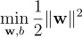
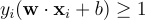

# Machine Learning Interview Preparation

## Table of Contents
1. [Introduction to Machine Learning](#introduction-to-machine-learning)
2. [ML Classic Concepts](#ml-classic-concepts)
   1. [Supervised Learning](#supervised-learning)
   2. [Unsupervised Learning](#unsupervised-learning)
   3. [Reinforcement Learning](#reinforcement-learning)
3. [Common Machine Learning Algorithms](#common-machine-learning-algorithms)
   1. [Linear Regression](#linear-regression)
   2. [Logistic Regression](#logistic-regression)
   3. [K-means Clustering](#k-means-clustering)
   4. [K-nearest Neighbors (KNN)](#k-nearest-neighbors)
   5. [Decision Trees](#decision-trees)
   6. [Random Forest](#random-forest)
   7. [Linear SVM](#linear-smv)
   8. [Principal Component Analysis (PCA)](#principal-component-analysis-pca)
   9. [Gradient Boosting](#gradient-boosting)
4. [Deep Learning](#deep-learning)
5. [Evaluation Metrics](#evaluation-metrics)
   1. [Confusion Matrix](#confusion-matrix)
   2. [Precision, Recall, F1 Score](#precision-recall-f1-score)
   3. [ROC Curve](#roc-curve)

### Introduction to Machine Learning

Machine learning is a field of artificial intelligence that focuses on the development of algorithms that enable computers to learn patterns and make predictions from data.

### ML Classic Concepts

#### Supervised Learning

:writing_hand: Supervised learning involves training a model on a labeled dataset, where each input is paired with the corresponding correct output. 
Commonly used for classification and regression tasks.

#### Unsupervised Learning

:writing_hand: Unsupervised learning deals with unlabeled data, aiming to find patterns or structures within it. 
Common techniques include clustering and dimensionality reduction.

#### Reinforcement Learning
 :writing_hand: Reinforcement learning involves an agent learning to make decisions by interacting with an environment. 
It receives feedback in the form of rewards or penalties.

### Common Machine Learning Algorithms

#### Linear Regression 

**Description:** Linear regression models the relationship between a dependent variable (output) and one or more independent variables (input) by fitting a linear equation (_y=mx+b_) to the observed data.

**How:** The solution is found by minimizing the sum of squared residuals (SSR) using methods like ordinary least squares.

**When to Use:** Suitable for predicting a continuous outcome.

**When Not to Use:** In cases where the relationship between variables is nonlinear, noise data, outliers. It prones to overfitting. Sometimes need extra time for pre-processing or feature engineering. 

**Pros and Cons:**
- *Pros:* Simple, interpretable, handles linear data very well.
- *Cons:* Assumes a linear relationship.

**Example:** Predicting house prices based on square footage.

**Connected Argument:** Feature engineering to capture non-linear relationships.

#### Logistic Regression

**Description:** Logistic regression is used for binary classification problems, predicting the probability that an instance belongs to a particular class.

**How:** It uses a logistic function (sigmoid) to map input values, providing probabilities between 0 and 1. The logistic loss or binary cross-entropy are used. Model estimates coefficients via **maximum likelihood estimation** or **gradient descent**.

**When to Use:** Binary classification problems.

**When Not to Use:** Multiclass classification tasks.

**Pros and Cons:**
- *Pros:* Simple, efficient for binary outcomes.
- *Cons:* Assumes a linear relationship.

**Example:** Predicting whether an email is spam or not.

**Connected Argument:** Regularization techniques for preventing overfitting.

#### K-means Clustering

**Description:** K-Means is a widely-used **unsupervised machine learning** to group data into _k_ clusters based on similarity.

**How:** It iteratively assigns data points to the nearest cluster center, updates the center by computing the mean of the assigned points, and repeats until convergence.

**When to Use:** Identifying natural groupings in data.

**When Not to Use:** Sensitive to initial cluster centroids.

**Pros and Cons:**
- *Pros:* Simple, scalable for large datasets.
- *Cons:* Sensitive to outliers.

**Example:** Customer segmentation.

**Connected Argument:** Distance metrics: Euclidean, Manhattan, cosine (the choice of distance metric impacts the clusters formed).

#### K-nearest Neighbors (KNN)

**Description:** KNN classifies new data points based on the majority class of their _k_ nearest neighbors.

**How:** It classifies a new data point by identifying its _k_ nearest neighbors and selecting the majority class.

**When to Use:** Simple and effective for small datasets.

**When Not to Use:** Sensitive to irrelevant features.

**Pros and Cons:**
- *Pros:* Simple, easy to understand.
- *Cons:* Computationally expensive for large datasets.

**Example:** Handwritten digit recognition.

**Connected Argument:** Distance metrics: Euclidean, Manhattan, cosine (the choice of distance metric and the value of _k_ impact classification results).

#### Decision Trees

**Description:** Decision trees are hierarchical structures that make decisions based on the values of input features.

**How:** It recursively splits the data based on the features that maximize information gain or Gini impurity.

**When to Use:** Versatile for both classification and regression tasks.

**When Not to Use:** Can overfit noisy data.

**Pros and Cons:**
- *Pros:* Easy to understand, no need for feature scaling.
- *Cons:* Prone to overfitting.

**Example:** Predicting whether a customer will buy a product.

**Connected Argument:** Pruning (to control the tree depth and prevent overfitting).

#### Random Forest 

**Description:** Random Forest is an ensemble method that builds multiple decision trees and merges their predictions.

**How:** It builds multiple decision trees on different subsets of the data and combines their predictions.

**When to Use:** Robust for various tasks, reduces overfitting.

**When Not to Use:** Less interpretable than a single decision tree.

**Pros and Cons:**
- *Pros:* High accuracy, handles missing values.
- *Cons:* Can be computationally expensive.

**Example:** Predicting stock prices.

**Connected Argument:** Tuning the number of trees and feature selection impact performance.

#### Linear SVM 

**Description:** SVM finds a hyperplane that best separates classes in a high-dimensional space.

**How:** It finds the hyperplane with the maximum margin, optimizing the weights.

**How:** It finds the hyperplane with the maximum margin by optimizing the weights using the following formula:

  

  

  

    
  

  

    Subject to the constraints:
  

  

    
  

where **w** is the weight vector, **b** is the bias term, and **x_i** is the data point.

**When to Use:** Effective for high-dimensional data.

**When Not to Use:** Less suitable for large datasets.

**Pros and Cons:**
- *Pros:* Effective in high-dimensional spaces.
- *Cons:* Not suitable for large datasets.

**Example:** Image classification.

**Connected Argument:** The kernel trick for handling non-linear relationships.

#### Principal Component Analysis (PCA)

**Description:** PCA reduces the dimensionality of data by transforming it into a new coordinate system.

**How:** It identifies the _eigenvectors_ and _eigenvalues_ of the covariance matrix.

**When to Use:** Reducing dimensionality and noise.

**When Not to Use:** Assumes linear relationships.

**Pros and Cons:**
- *Pros:* Efficient for high-dimensional data.
- *Cons:* May lose interpretability.

**Example:** Facial recognition.

**Connected Argument:** The number of components impacts the trade-off between dimensionality reduction and information loss.

#### Gradient Boosting
**Description:** Gradient Boosting builds an ensemble of weak learners and improves upon their predictions.

**How:** It fits a series of weak learners, each correcting the errors of the previous one.

**When to Use:** Effective for improving model performance.

**When Not to Use:** Computationally expensive.

**Pros and Cons:**
- *Pros:* High accuracy.
- *Cons:* Prone to overfitting.

**Example:** Predicting click-through rates.

**Connected Argument:** The learning rate and tree depth affect the trade-off between model complexity and accuracy.

#### Perceptron

**Description:** A perceptron is a simple binary classification algorithm capable of learning linear decision boundaries.

**How:** The perceptron learns by adjusting the weights based on misclassifications using the perceptron learning rule.

\[ \mathbf{w}_{\text{new}} = \mathbf{w}_{\text{old}} + \eta \cdot (\text{target} - \text{output}) \cdot \mathbf{x} \]

where \(\mathbf{w}\) is the weight vector, \(\eta\) is the learning rate, and \(\mathbf{x}\) is the input vector.

**When to Use:** Simple tasks with linearly separable data.

**When Not to Use:** In the case of non-linear separability.

**Pros and Cons:**
- *Pros:* Fast convergence for linearly separable data.
- *Cons:* Limited to linear decision boundaries.

**Example:** Binary classification of flower species based on petal length and width.

**Connected Argument:** The choice of activation function influences the learning capacity.

#### Multi-Layer Perceptron (MLP)

**Description:** MLP is a type of artificial neural network with multiple layers, including an input layer, one or more hidden layers, and an output layer.

**How:** MLP learns by adjusting the weights using backpropagation and gradient descent.

**When to Use:** Complex tasks requiring non-linear mappings.

**When Not to Use:** Small datasets or tasks with limited complexity.

**Pros and Cons:**
- *Pros:* Suitable for complex tasks, can learn non-linear relationships.
- *Cons:* Prone to overfitting, requires careful tuning.

**Example:** Handwritten digit recognition.

**Connected Argument:** The choice of activation functions in hidden layers and output layer affects the network's capacity to capture non-linear patterns.
