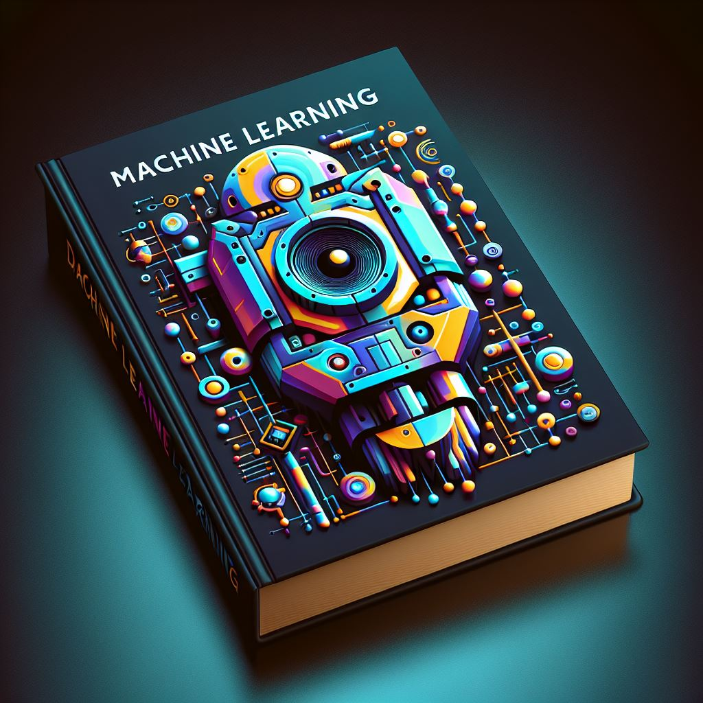

# Machine Learning Interview Preparation

## Table of Contents
1. [Introduction to Machine Learning](#1-introduction-to-machine-learning)
2. [ML Classic Concepts](#ml-classic-concepts)
   1. [Supervised Learning](#supervised-learning)
   2. [Unsupervised Learning](#unsupervised-learning)
   3. [Reinforcement Learning](#reinforcement-learning)
3. [Common Machine Learning Algorithms](#3-common-machine-learning-algorithms)
   1. [Linear Regression](#linear-regression)
   2. [Logistic Regression](#logistic-regression)
   3. [K-means Clustering](#k-means-clustering)
   4. [K-nearest Neighbors](#k-nearest-neighbors)
   5. [Decision Trees](#decision-trees)
   6. [Random Forest](#random-forest)
   7. [Linear SVM](#linear-smv)
   8. [Principal Component Analysis (PCA)](#principal-component-analysis-pca)
   9. [Gradient Boosting](#gradient-boosting)
4. [Deep Learning](#deep-learning)
5. [Evaluation Metrics](#evaluation-metrics)
   1. [Confusion Matrix](#confusion-matrix)
   2. [Precision, Recall, F1 Score](#precision-recall-f1-score)
   3. [ROC Curve](#roc-curve)

### Introduction to Machine Learning

Machine learning is a field of artificial intelligence that focuses on the development of algorithms that enable computers to learn patterns and make predictions from data.

### ML Classic Concepts

#### Supervised Learning
#### Unsupervised Learning
#### Reinforcement Learning

### Linear Regression 

Linear regression is a machine learning algorithm that explores relationships between variables, particularly between the output (dependent variable) and one or more inputs (independent variables). 
The fundamental equation is _y=mx+b_, where _y_ is the output, _x_ is the input, _m_ is the slope of the line, and _b_ is the bias.

The goal is to find a function that maps certain features or variables to others. 
Regression answers questions about how one phenomenon influences another or how different variables are correlated. 
It is also useful for making predictions with new data.

To obtain the best predictive weights, the algorithm minimizes residual errors, which are the differences between predicted and actual responses. 
This is achieved by reducing the sum of squared residuals (SSR) for all observations, known as the method of ordinary least squares.

When to use:
- easy simple to train and implement 
- quick: can be done in one-shot or gradient descent 
- handles linear data very well 

When not to use: 
- not linear relation (complex relation) 
- noise  
- outliers
- prone to overfitting 
- maybe need extra time for pre-processing or feature engineering 

### Logistic Regression

**Purpose**: Logistic regression is a statistical method used for <ins>binary classification</ins>.
Ideal for binary dependent variables (output) with continuous or categorical independent variables (input).

**Model Function**: Uses a logistic function (sigmoid) to map input values, providing probabilities between 0 and 1.

**Cost Function**: In logistic regression, the cost function is commonly expressed as the cross-entropy loss. For binary classification problems, the logistic loss or binary cross-entropy is used. 

**Coefficient Estimation**: Model estimates coefficients via **maximum likelihood estimation** or **gradient descent**.

**Prediction**: After training, predicts new data and classifies based on a user-defined threshold probability.

### K-means Clustering

K-means clustering is a widely-used **unsupervised machine learning** algorithm designed to group data points with similarities into k clusters. 
The objective is to partition a given dataset into a <ins>predetermined number of clusters.</ins>

**Initialization**: Start by randomly placing k cluster centers in the feature space, with each center representing a cluster.
**Assignment**: Associate each data point with the nearest cluster center based on a chosen distance metric. <ins>Euclidean distance</ins> is common, but alternatives like Manhattan distance or cosine similarity are viable.
**Update**: Calculate the new mean for each cluster by averaging the data points within that cluster. These means become the updated cluster centers.
**Iteration**: Repeat the assignment and mean calculation steps until the cluster assignments stabilize or until a specified number of iterations is reached.

The outcome is a set of k clusters, where each cluster comprises data points that exhibit the most similarity according to the chosen distance metric.
K-means finds applications in diverse domains such as image segmentation, market segmentation, and customer profiling.

### K-nearest Neighbors

### Decision Trees

### Linear SVM
