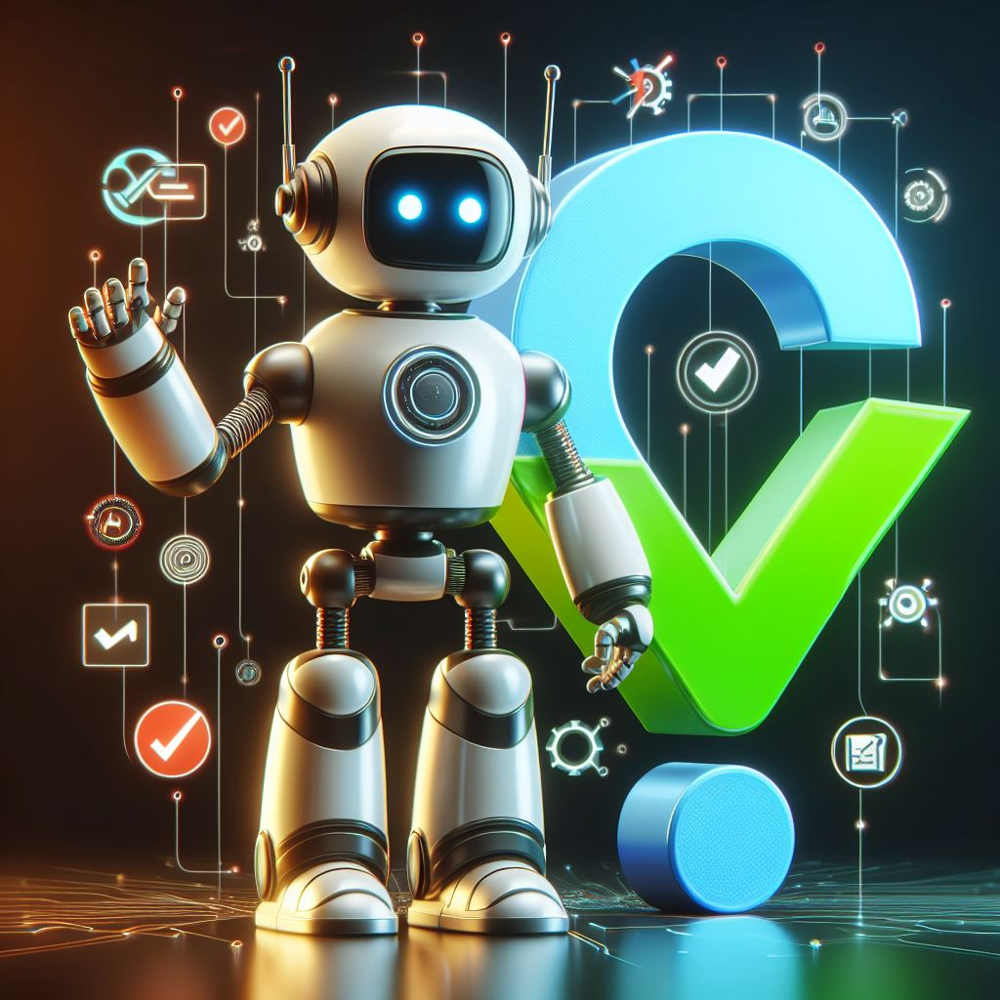

# Machine Learning (ML) Interview Preparation.
Dive into Python-based resources and code examples to master ML interview challenges.
From algorithms to computer vision-based questions, this repository guides you through comprehensive preparation for interview excellence.

## Todo:
- [ ] complete the section for deep learning
- [ ] add sorting algorithm in the python section
- [ ] add test_yourself branch that containg only questions
