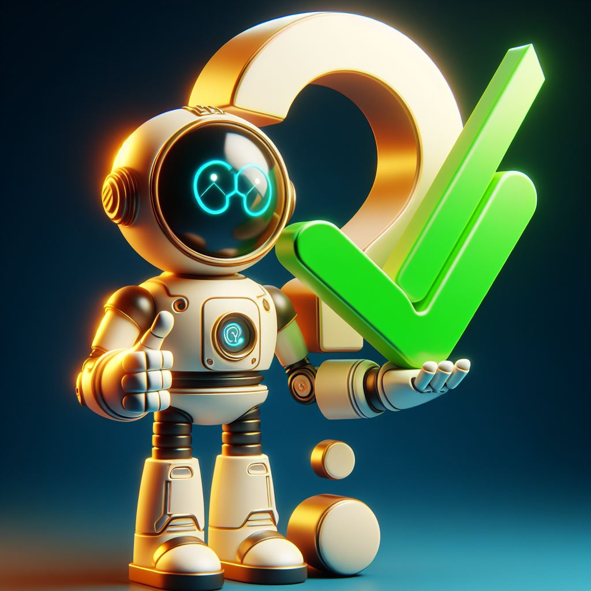

# From-PhD-to-ML-Interviews-With-Python
Prepare for success in Machine Learning (ML) interviews after completing your Ph.D. 

Dive into Python-based resources and code examples for mastering ML interview challenges. 
From algorithms to computer vision-based questions, this repository guides Ph.D. graduates through Pythonic strategies for interview excellence.

